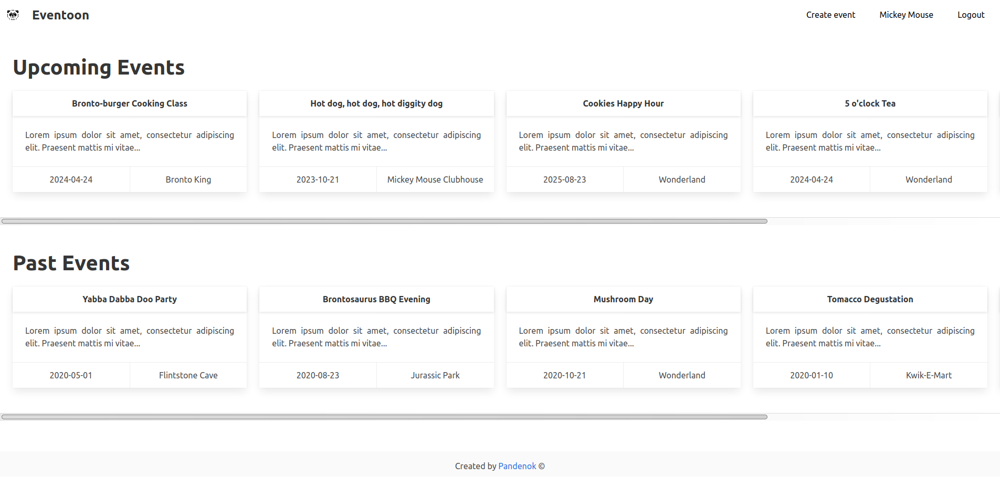
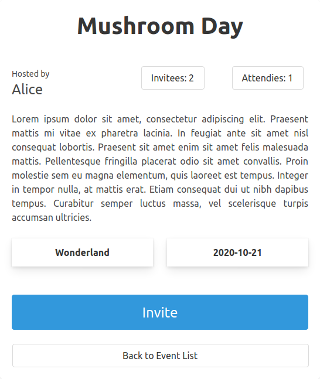
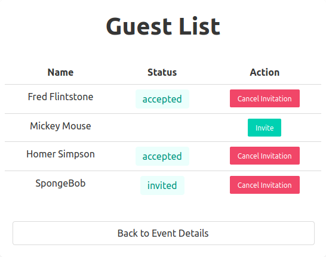

# Project: Private Events

## What's this

A project completed as part of [The Odin Ruby on Rails Learning Track](https://www.theodinproject.com/courses/ruby-on-rails/lessons/associations) to dive into ActiveRecord’s associations. The project involves building a private website with similar functionality to the well known event organization and management platform [Eventbrite](https://www.eventbrite.com/).

## Live Demo

You can try it out [here](https://gentle-shelf-63524.herokuapp.com/)  
**HEADS UP**: Heroku server may need up to 30 sec to fire up a dyno. Be patient! :)  
You can use 'Fred Flintstone', 'Alice', 'Mickey Mouse', 'Homer Simpson' or 'SpongeBob' as test users to see full functionality.

## Screenshots

For those who are not patient, here are a couple of screenshots of what it looks like

<p float = 'left'>
  
  
  
</p>

## Functionality

As far as this is a training app with focus on ActiveRecord's associations, User authentication and authorization are extremely barebone with no validations or real security of access: no need for a password, anyone is able to sign in/sign up through a basic hand-rolled authentication by their name. After the registration/login they're able to create events, invite other users as well as to enroll for events organized by others. Always because it's an exercise, users can create and enroll for the events with the past dates to practice rails' scopes. In a similar vein, just strictly necessary RESTful actions were implemented in the controllers: for example, you can't edit/delete users/events. Nevertheless, the styling was not requested, I built a minimalistic design using `bulma` gem, a CSS framework based on Flexbox.

## Getting started

To get started with the app, make sure you have Rails and Git installed on your machine  

<details>
  <summary>Get instructions</summary>

  Clone the repo to your local machine: 
  ```ruby
  $ git clone https://github.com/Pandenok/private-events.git
  ```
  Then, install the needed gems:
  ```ruby
  $ bundle install
  ```
  Next, migrate the database:
  ```ruby
  $ rails db:migrate
  ```
  If you want to load sample users and events, use seeds:
  ```ruby
  $ rails db:seed
  ```
  Finally, on root path run a local server:
  ```ruby
  $ rails server
  ```
  Open browser to view application:
  ```ruby
  localhost:3000
  ```
</details>   

## Reflection

This was an awesome rundown practice and I had a really joyful fun playing with associations, until I bumped into extra credit on allowance to invite other users.

<details>
  <summary>Spoiler alert! Click to continue reading...</summary>

  In the beginning, I added an `Invitations` model to my app, because in real world `invitation` and `enrollment` are two conceptually different things. And I made it work with this setup. IMHO, two join models looked very similar:
  ```ruby
  class Enrollment < ApplicationRecord
    belongs_to :event
    belongs_to :user
  end
  class Invitation < ApplicationRecord
    belongs_to :event
    belongs_to :host, class_name: "User"
    belongs_to :invitee, class_name: "User"
  end
  ```
  So, I decided to go with one model, got rid off `Invitations` and put everything in `Enrollment`.
  ```ruby
  class Enrollment < ApplicationRecord
    belongs_to :event
    belongs_to :user
    belongs_to :host, class_name: "User"
    belongs_to :invitee, class_name: "User"
  end
  ```
  As far as `User` invites other `User`, it felt right to apply self joins, so I created something like
  ```ruby
  class User < ApplicationRecord
    has_many :events
    has_many :enrollments
    has_many :attended_events, through: :enrollments, source: :event
    
    has_many :invited_users, foreign_key: "host_id", class_name: 'Enrollment'
    has_many :invitees, through: :invited_users
    has_many :hosting_users, foreign_key: "invitee_id", class_name: 'Enrollment'
    has_many :hosts, through: :hosting_users
  end
  ```
  And to my surprise associations were working! As far I got rid off `Invitation` controller I had no idea on how to split `enrollment` and `invitation` creation, what routes to use, etc. At this point I tried different things and finished asking support to the forum. @GopherJackets was really helpful in the understanding of my model set up and cleaning it up. Then the conversation with @nalyk inspired me to find an interesting solution: when a creator of the event sends an invitation, it triggers the creation of a new `enrollment` joining only `invitee_id` and `event_id` (I had to set `user_id` as `optional` to make it work). When the invited user accepts the invite by enrolling to the event, it was updating an existing `enrollment` with his `id` in `user_id` column. The only issue was on how to drop an enrollment without canceling the invitation. And here I had an eye-opening talk with @Roli who not only explained how to fix the bug, but helped me polish completely the app and adviced to use `enum status`, which makes the extra task super easy. You're seeing the final result of Data model.

  A couple of interesting articles on `enum` are [here](https://sipsandbits.com/2018/04/30/using-database-native-enums-with-rails/) and [here](https://naturaily.com/blog/ruby-on-rails-enum). 

</details>   

